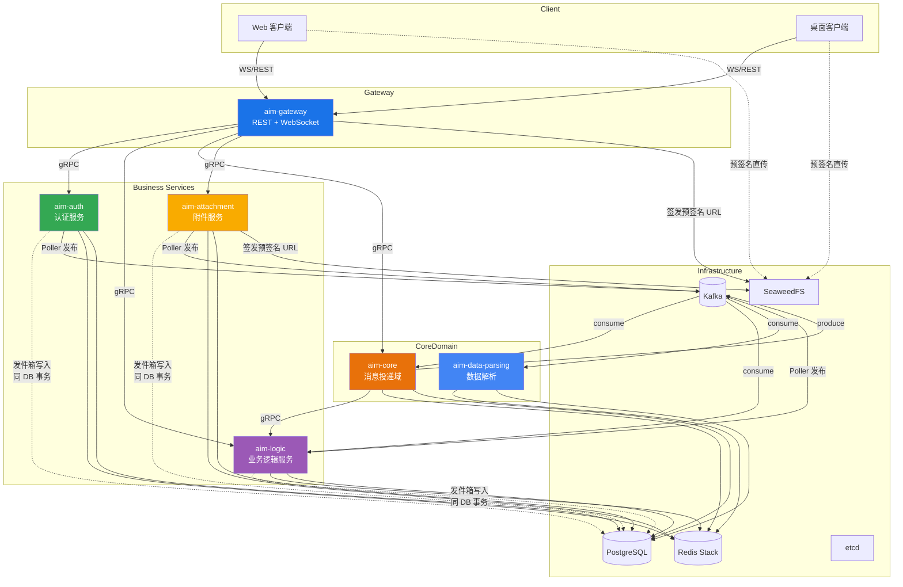

# AIM — 分布式多人在线即时通讯系统

> AIM 是一个基于 **go-zero** 微服务架构的分布式即时通讯系统，内置可自部署的 AI 助手（Bot OpenAPI）。

---

## 核心特性

### 通信能力

- **实时消息**：WebSocket + Protobuf 帧协议，支持私聊与群聊
- **已读回执 & 输入状态**：消息级已读追踪、typing indicator 实时推送
- **多端同步**：基于 DeviceId 的多设备登录，消息一致投递
- **断线重连**：WS 帧等待队列 + 重放机制

### [雪花ID](app/shared/tools/snowflake.go)

- 小回拨: 时间戳不变序列号递增
- 大回拨: 等待系统时钟追赶/直接抛出错误

### [发件箱模式](app/shared/outbox/outbox.go)

- 通过本地数据库事务的原子性保证发往 kafka 的消息至少能被成功发送一次

### [穿透 读/写 缓存模式](app/shared/cache/cache.go)

- 由缓存组件负责读取数据库并回写缓存
- 内存 + redis 双层缓存
- 基于 [go-zero 缓存组件](https://go-zero.dev/components/cache/) 封装
- 内置 singleflight 语义，防止缓存击穿
- 内置 key ttl 随机抖动，防止缓存雪崩

### [限流算法](app/shared/quota/quota.go)

- 基于 redis zset(sorted set) 数据结构的滑动窗口算法

### 熔断器

- [go-zero 内置](https://go-zero.dev/zh-cn/components/resilience/circuit-breaker/)

### Bot OpenAPI

- **第三方 Bot 接入**：独立 `/api/bot/v1` 路由，Token 鉴权 + Webhook 事件推送
- **Bot 会话操作**：发消息、查历史、获取成员、标记已读
- **用户侧 Bot 管理**：创建/编辑/启用/禁用 Bot、Token 生命周期管理
- 详见 [Bot SDK 文档](bot_sdk/README.md) 及 [aim-bot-domain Skill](skills/aim-bot-domain/SKILL.md)

### 社交功能

- **好友管理**：申请/接受/拒绝 + 自定义标签体系
- **群组管理**：创建、加人/踢人、群主转让、管理员授予/撤销、退群、解散
- **聚合搜索**：统一搜索用户、好友、群组、消息内容
- **在线状态**：Presence 状态广播

### 附件系统

- 预签名直传 SeaweedFS（S3 协议），支持 image/video/audio/file
- 异步解析媒体元数据，自动转码生成缩略图
- 详见 [aim-attachment-domain Skill](skills/aim-attachment-domain/SKILL.md)

### 可观测性

- OpenTelemetry 全链路追踪 → Grafana Tempo
- Prometheus 指标 → Grafana 仪表盘
- Loki + Promtail 日志聚合
- 详见 [aim-docker-datastore Skill](skills/aim-docker-datastore/SKILL.md)

---

## 技术架构

### 架构图



### 微服务划分

| 服务                 | 职责                                                                                  |
| -------------------- | ------------------------------------------------------------------------------------- |
| **aim-gateway**      | 对外入口，REST API 代理 + WebSocket 连接管理，JWT 验签                                |
| **aim-auth**         | 注册/登录、JWT 签发与刷新、多设备会话管理；注册成功后发布 `UserCreatedEvent` 到 Kafka |
| **aim-core**         | 消息路由与投递，Kafka 消费者集群                                                      |
| **aim-logic**        | 用户/好友/群组/Bot 业务逻辑、聚合搜索                                                 |
| **aim-attachment**   | 附件上传预签名、元数据管理、下载授权                                                  |
| **aim-data-parsing** | 异步提取附件媒体元数据、生成缩略图                                                    |

> 依赖约束：Logic 绝不导入 Core；客户端只与 Gateway 通信。详见 [aim-repo-mapping Skill](skills/aim-repo-mapping/SKILL.md)。

---

## 技术栈

| 层次           | 技术                                        |
| -------------- | ------------------------------------------- |
| **语言**       | Go 1.26                                     |
| **微服务框架** | go-zero v1.10.1                             |
| **WebSocket**  | coder/websocket + Protobuf 帧协议           |
| **RPC**        | Protobuf / gRPC                             |
| **消息队列**   | Kafka（`conversation_id` 分区保序）         |
| **缓存**       | Redis Stack                                 |
| **持久化**     | PostgreSQL（sqlc）                          |
| **文件存储**   | SeaweedFS（S3 协议）                        |
| **注册中心**   | etcd                                        |
| **可观测性**   | OpenTelemetry + Prometheus + Loki → Grafana |

---

## 压测

```bash
    # 启动压测环境
    cd /home/hpxx/aim/dev-tool && docker compose up -d

    # 500用户注册 + 限速50RPS + 10s渐进加压
    python benchmark.py register --users 500 --rps 50 --ramp-up 10

    # 50用户WS消息压测，每用户500条
    python benchmark.py ws-message --users 50 --messages-per-user 500 --quiet

    # 100用户混合负载60秒
    python benchmark.py mixed --users 100 --duration 60 --rps 200 --output report.json
```

### 总体概况

| 场景                  | 用户数 | 总请求 | 成功   | 失败 | 成功率 | 耗时  |
| --------------------- | ------ | ------ | ------ | ---- | ------ | ----- |
| register              | 100    | 100    | 100    | 0    | 100%   | 40.9s |
| friend-chain (加好友) | 38 对  | 38     | 38     | 0    | 100%   | 0.0s  |
| friend-chain (接受)   | 38 对  | 38     | 38     | 0    | 100%   | 0.0s  |
| ws-message            | 19 对  | 380    | 380    | 0    | 100%   | 40.3s |
| mixed                 | 100    | 41,094 | 41,094 | 0    | 100%   | 30.0s |

### 吞吐量

| 场景                  | 平均 QPS |
| --------------------- | -------- |
| register              | 2.4      |
| friend-chain (加好友) | 937.9    |
| friend-chain (接受)   | 1,045.1  |
| ws-message            | 9.4      |
| mixed                 | 1,368.9  |

### 延迟分布 (ms)

| 场景                  | Min   | Avg   | Max   | P50   | P90   | P95   | P99   |
| --------------------- | ----- | ----- | ----- | ----- | ----- | ----- | ----- |
| register              | 82.0  | 91.8  | 122.3 | 90.8  | 98.5  | 100.7 | 122.3 |
| friend-chain (加好友) | 6.3   | 13.7  | 22.7  | 13.8  | 20.4  | 20.8  | 22.7  |
| friend-chain (接受)   | 5.4   | 10.8  | 20.7  | 9.8   | 16.6  | 19.5  | 20.7  |
| ws-message            | 1,470 | 2,020 | 2,270 | 2,240 | 2,260 | 2,260 | 2,260 |
| mixed                 | 0.4   | 6.0   | 18.9  | 5.3   | 8.6   | 9.4   | 11.2  |

---

## 快速开始

### 环境准备

- **Go** ≥ 1.26
- **Docker** + Docker Compose

### 本地部署

```bash
# 启动基础设施 + 业务服务
docker compose --env-file deploy/env/local.env \
  -f deploy/compose/base.yaml \
  -f deploy/compose/dev.yaml \
  up -d --build

# （可选）启动可观测性
docker compose --env-file deploy/env/local.env \
  -f deploy/compose/base.yaml \
  -f deploy/compose/dev.yaml \
  -f deploy/compose/observability.yaml \
  up -d --build

# 本地构建
go mod tidy
go build ./...
```

> 部署拆分说明见 `deploy/README.md`。

---

## 项目结构

```
aim/
├── app/
│   ├── auth/rpc/          # 认证服务
│   ├── core/rpc/          # 消息投递服务
│   ├── gateway/api/       # 对外入口（REST + WebSocket）
│   ├── logic/rpc/         # 业务逻辑服务
│   ├── attachment/        # 附件服务
│   ├── data_parsing/      # 数据解析服务
│   └── shared/            # 进程内共享包
├── .githooks/            # Git pre-commit hook（自动格式化）
├── shared/proto/          # Protobuf 协议定义
├── skills/                # 领域 Skill 文档
├── deploy/                # 部署编排
├── model/                 # sqlc 全局数据模型
└── docker-compose.yaml    # 本地兼容入口
```

---

## API 文档

API 契约定义在 [`app/gateway/api/gateway.api`](app/gateway/api/gateway.api)，采用 **Spec-first** 模式。

| 分组          | 前缀                 | 说明                         |
| ------------- | -------------------- | ---------------------------- |
| 认证          | `/api/auth`          | 注册、登录、刷新 Token、注销 |
| 用户          | `/api/users`         | 用户查询、好友申请           |
| 会话          | `/api/conversations` | 会话 CRUD、群管理、历史消息  |
| 好友          | `/api/friends`       | 好友列表、标签管理           |
| 搜索          | `/api/search`        | 聚合搜索                     |
| 附件          | `/api/attachments`   | 上传/下载/查询               |
| Bot OpenAPI   | `/api/bot/v1`        | 第三方 Bot 接口              |
| 用户 Bot 管理 | `/api/user/bots`     | Bot 创建/管理/Token 管理     |

### 开发测试工具

内置 `aim-dev-tool`（Python CLI），支持 REST/WS 调试、并发压测。详见 [aim-dev-tool Skill](skills/aim-dev-tool/SKILL.md)。

---

## 测试与代码质量

```bash
go test ./...                       # 运行全部测试（73 个测试文件）
go test -coverprofile=coverage.out ./...  # 覆盖率
golangci-lint run                   # 代码检查
goctl api validate                  # API 契约校验
```

### Pre-commit 钩子

项目内置 Git pre-commit hook（位于 `.githooks/`），提交前自动格式化 Go 代码：

```bash
# 在项目根目录执行一次即可激活：
git config core.hooksPath .githooks
```

钩子使用 `gofumpt`（优先）/ `gofmt`（fallback）格式化 staged Go 文件，
并在 `go.mod` 变更时自动执行 `go mod tidy`。

## 详见 [aim-dev-tool Skill](skills/aim-dev-tool/SKILL.md)。

## 开发指南

- **Spec-first**：REST 先改 `.api`，RPC 先改 `.proto`，再 goctl/protoc 生成
- **Skill 驱动开发**：领域知识文档化为 Skill，Agent 渐进式加载
- **数据模型**：使用 sqlc，SQL 源文件在 `model/{migrations,queries}`
- **错误处理**：业务错误使用 `errorx.NewCodeError`
- 详细约定见 [AGENTS.md](AGENTS.md)

---

## 未来规划

- [ ] 官方群聊 Bot
- [ ] ~WS 帧并包优化~
- [x] [RAG 知识库 Bot 集成](https://github.com/hellopoisonx/echo)

---

## 相关项目

| 项目                                                       | 说明                |
| ---------------------------------------------------------- | ------------------- |
| [aim-desktop](https://github.com/hellopoisonx/aim-desktop) | 桌面客户端          |
| [echo](https://github.com/hellopoisonx/echo)               | 官方 RAG 知识库 Bot |
| [bot_sdk](bot_sdk/README.md)                               | Bot SDK 文档        |
