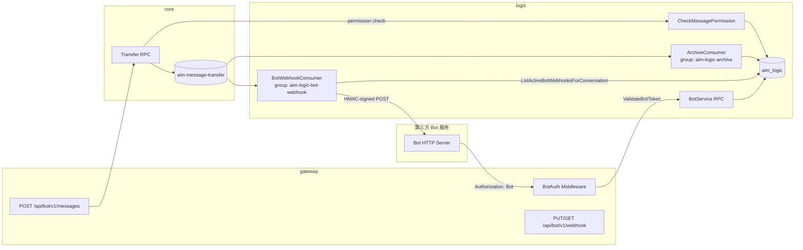
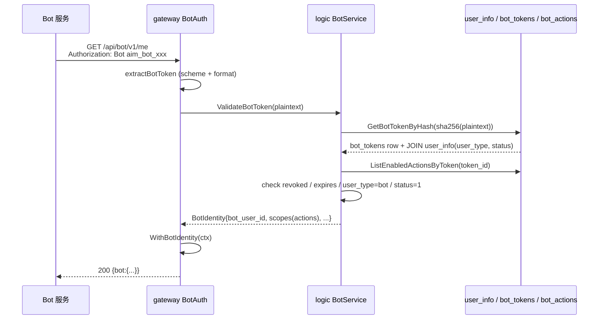
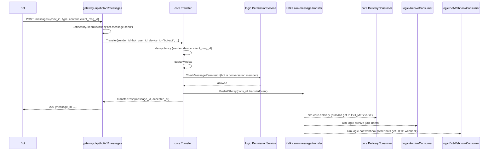

# Bot OpenAPI V0 架构参考

## 全链路



## 鉴权流



## 发消息



## Webhook 投递

- 消费 `aim-message-transfer`，独立 group 保证 offset 与 archive 解耦。
- 对每条事件：
  1. `ListActiveBotWebhooksForConversation(conv_id)` —— 一次 SQL 拿到该群里所有
     `enabled=true` 且 `user_type='bot'` 的 webhook。
  2. 过滤 `bot_user_id == sender_id`（防自回调），过滤未订阅 `message.created` 的。
  3. 并行 HTTP POST，HMAC-SHA256 签名（`secret_hash` 作为 key）。
  4. 失败 → 指数退避 1s/2s/4s/8s/16s，最多 5 次；最终失败仅 log，不阻塞 offset。
- payload 字段固定，详见 `docs/bot-developer-guide.md` §4.1。

## 关键文件

| 路径 | 作用 |
|------|------|
| `app/logic/rpc/model/migrations/006_user_type.sql` | `user_info.user_type` |
| `app/logic/rpc/model/migrations/007_bot_tokens.sql` | `bot_tokens` |
| `app/logic/rpc/model/migrations/008_bot_webhooks.sql` | `bot_webhooks` |
| `app/logic/rpc/model/migrations/009_bot_actions.sql` | `bot_actions` / `bot_token_permissions` / `bot_event_actions` |
| `app/logic/rpc/model/queries/bot_token.sql` | sqlc Bot Token 查询 |
| `app/logic/rpc/model/queries/bot_webhook.sql` | sqlc Bot Webhook 查询 |
| `app/logic/rpc/logic.proto` | `BotService` RPC 定义 |
| `app/logic/rpc/internal/service/bot_service.go` | 业务逻辑（token 校验、webhook CRUD） |
| `app/logic/rpc/internal/mqs/bot_webhook_consumer.go` | Kafka consumer + HTTP 投递 |
| `app/gateway/api/gateway.api` | `/api/bot/v1/*` 路由声明 |
| `app/gateway/api/internal/middleware/botauth_middleware.go` | BotAuth |
| `app/gateway/api/internal/botctx/identity.go` | 上下文工具 |
| `app/gateway/api/internal/logic/bot/bot_send_message_logic.go` | REST → core.Transfer |
| `app/shared/bottoken/bottoken.go` | token / secret 工具 |
| `scripts/bot-provision/provision_bot.sh` | 运维 provision |
| `scripts/bot-provision/provision_bot.sql` | provision SQL 模板 |
| `docs/bot-developer-guide.md` | 第三方接入说明 |
| `docs/api/gateway-openapi.yaml` | Swagger（含 Bot 端点） |

## 配置

`app/logic/rpc/etc/logic.yaml` 中：

```yaml
BotWebhookConsumerConf:
  Name: logic-bot-webhook-consumer
  Brokers: [kafka:9092]
  Group: aim-logic-bot-webhook
  Topic: aim-message-transfer
  Offset: last
  Consumers: 1
  Processors: 1
```

`Offset: last` 是有意为之 —— Bot 投递不应回放历史消息。归档消费者继续用
`Offset: first` 保证消息持久化无遗漏。
