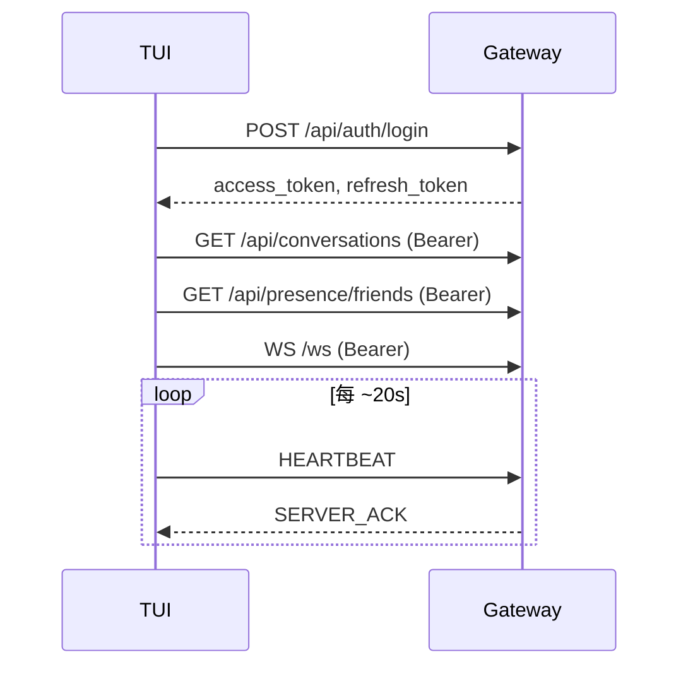
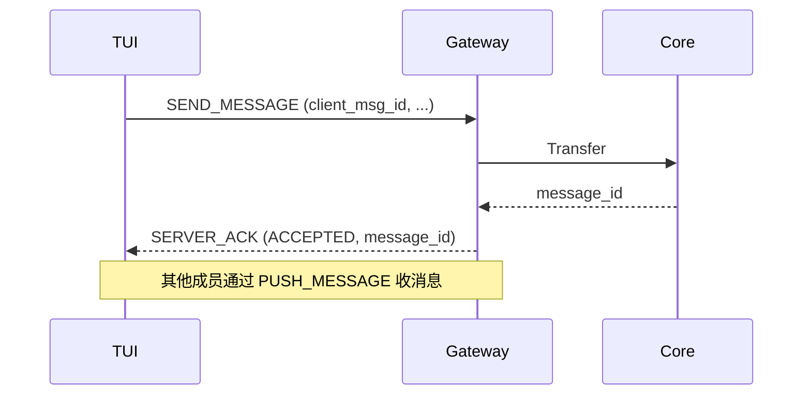
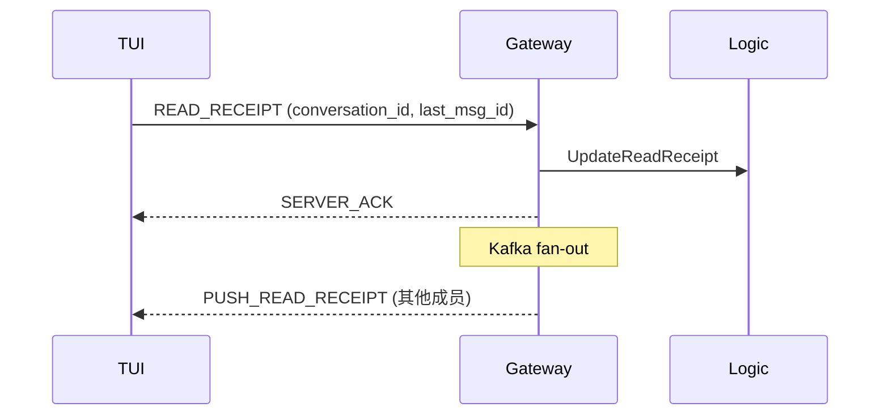
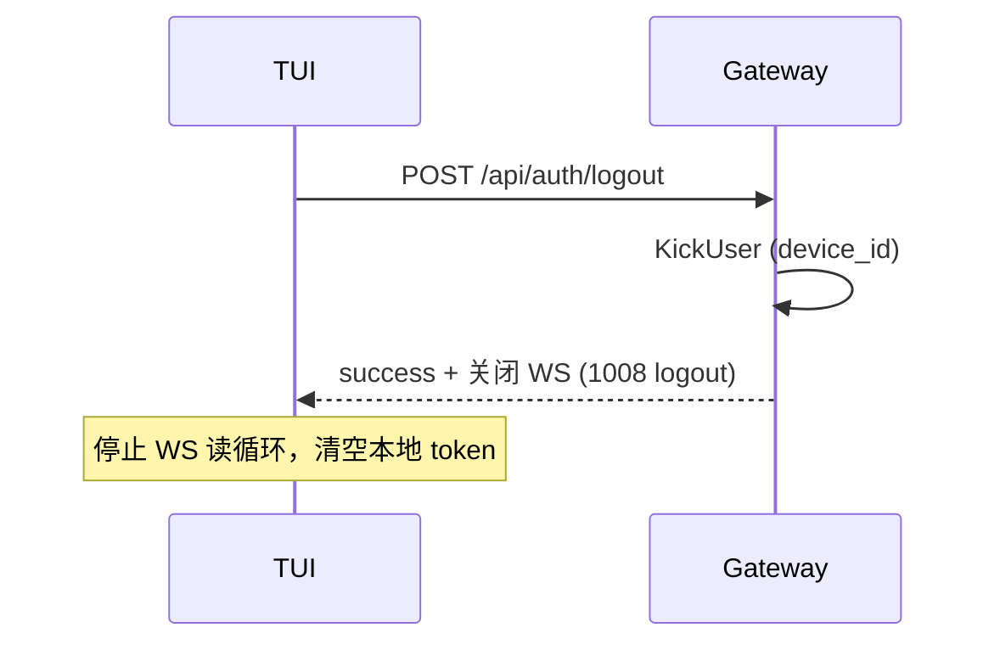

# Gateway API 参考（TUI 客户端）

> **来源**：`app/gateway/api/gateway.api`、`shared/proto/ws/ws.proto`、`shared/proto/gateway/gateway.proto`  
> **默认地址**：`http://localhost:8888`（REST）、`ws://localhost:8888/ws`（WebSocket）  
> **更新日期**：2026-05-23（与 proto 实现差距修复同步）

TUI 仅通过 gateway 通信：REST 使用 `app/tui/internal/client`，WS 使用 `app/tui/internal/wsclient`。Proto 定义以 `shared/proto/ws/ws.proto` 为准；服务端推送语义与 `skills/aim-proto-domain/references/protocol-rules.md` 保持一致。

---

## 1. 通用约定

### 1.1 REST 响应信封

成功与业务错误均返回 JSON 信封（HTTP 状态码与 `code` 对应）：

```json
{
  "code": 0,
  "msg": "ok",
  "body": { }
}
```

| 字段 | 说明 |
| --- | --- |
| `code` | `0` 表示成功；非零为业务错误码 |
| `msg` | 人类可读消息 |
| `body` | 成功时的业务数据；错误时通常省略 |

`Auth` 中间件校验失败（401）返回 `{ "code": <int>, "msg": "<string>" }`，**无** `body` 字段。

### 1.2 鉴权

| 场景 | 方式 |
| --- | --- |
| REST 受保护端点 | `Authorization: Bearer <access_token>` |
| WebSocket 升级 | 同上，仅支持 **Header**（`?token=` 无效） |
| JWT payload | `user_id`、`device_id` |

`device_id` 在注册/登录时必填，用于多端区分与踢下线。

### 1.3 错误码

**认证域（1xxx，多用于 auth RPC）**

| code | 含义 |
| --- | --- |
| 1001 | 邮箱或密码错误 |
| 1002 | 用户不存在 |
| 1003 | 用户已存在 |
| 1004 | Token 无效 |
| 1005 | Token 过期 |
| 1006 | 用户被封禁 |

**RPC/网关域（40xxx–50xxx）**

| code | HTTP | 含义 |
| --- | --- | --- |
| 40000 | 400 | 参数错误 |
| 40100 | 401 | 未授权 |
| 40300 | 403 | 禁止访问 |
| 40400 | 404 | 资源不存在 |
| 40900 | 409 | 冲突 |
| 42900 | 429 | 限流（core `Transfer` 滑动窗口；WS 发消息时映射为 `SERVER_ACK` + `ACK_STATUS_REJECTED`） |
| 50000 | 500 | 内部错误（对外文案常为 `internal error`） |

### 1.4 时间戳

- REST/WS 中的 `created_at`、`updated_at`、`sent_at`、`expires_at` 等均为 **Unix 毫秒**（`int64`），除非字段说明另有约定。

---

## 2. REST API

### 2.1 认证 `/api/auth`

| Method | Path | 鉴权 | 说明 |
| --- | --- | --- | --- |
| POST | `/api/auth/register` | 否 | 注册 |
| POST | `/api/auth/login` | 否 | 登录 |
| POST | `/api/auth/refresh` | 否 | 刷新 Token |
| POST | `/api/auth/logout` | Bearer | 登出 |

#### POST `/api/auth/register`

**请求**

```json
{
  "email": "user@example.com",
  "password": "password12",
  "username": "用户昵称",
  "avatar": "可选头像 URL",
  "device_id": "tui-desktop-1"
}
```

| 字段 | 约束 |
| --- | --- |
| `email` | 必填，合法邮箱 |
| `password` | 必填，最少 8 位 |
| `username` | 必填，用户昵称 |
| `device_id` | 必填 |

**响应 `body`**

```json
{ "user_id": 12345 }
```

#### POST `/api/auth/login`

**请求**

```json
{
  "email": "user@example.com",
  "password": "password12",
  "device_id": "tui-desktop-1"
}
```

**响应 `body`**

```json
{
  "user_id": 12345,
  "access_token": "<jwt>",
  "refresh_token": "<jwt>",
  "expires_at": 1716451200000
}
```

#### POST `/api/auth/refresh`

**请求**

```json
{ "refresh_token": "<jwt>" }
```

**响应 `body`**：与 login 相同（`access_token`、`refresh_token`、`expires_at`）。

#### POST `/api/auth/logout`

无请求体；Header 带 `Authorization: Bearer <access_token>`。

**响应 `body`**

```json
{ "success": true }
```

**副作用**：网关会 best-effort 调用 `KickUser`，关闭当前 JWT 对应 `device_id` 的 WebSocket 连接（关闭码 1008，reason=`logout`）。TUI 登出后应停止本地 WS 读循环，避免在已失效 token 上继续收发。

---

### 2.2 用户 `/api/users`

均需 `Auth` 中间件。

| Method | Path | 说明 |
| --- | --- | --- |
| GET | `/api/users/by-name/:name` | 按昵称模糊搜索 |
| GET | `/api/users/by-id/:id` | 按 ID 查用户详情 |
| POST | `/api/users/friends/:id` | 向 `:id` 发起好友申请 |

#### GET `/api/users/by-name/:name`

昵称不唯一，返回列表而非单用户。

**响应 `body`**

```json
{
  "users": [
    { "id": "12345", "email": "a@example.com", "avatar": "" }
  ]
}
```

> 注意：`id` 在 API 层为 **字符串**。

#### GET `/api/users/by-id/:id`

**响应 `body`**

```json
{
  "user": {
    "id": 12345,
    "email": "a@example.com",
    "status": 1,
    "nickname": "Alice",
    "avatar": "",
    "created_at": 1716451200000,
    "updated_at": 1716451200000
  }
}
```

#### POST `/api/users/friends/:id`

`:id` 为目标用户 ID（正整数）。当前用户从 JWT 取得。

**响应 `body`**

```json
{
  "friendship": {
    "user_id": 100,
    "friend_id": 200,
    "status": "pending",
    "created_at": 1716451200000,
    "updated_at": 1716451200000
  }
}
```

**好友关系 `status`**：`pending` | `accepted` | `blocked`

---

### 2.3 好友 `/api/friends`

均需 `Auth` 中间件。

| Method | Path | 说明 |
| --- | --- | --- |
| GET | `/api/friends/applications` | 收到的待处理申请 |
| GET | `/api/friends/me` | 已接受好友列表 |
| POST | `/api/friends/accept/:id` | 接受申请（`:id` 为申请人 user_id） |
| POST | `/api/friends/reject/:id` | 拒绝申请 |

**`FriendshipItem` 结构**（applications / me / accept / reject 共用）

```json
{
  "user_id": 100,
  "friend_id": 200,
  "status": "accepted",
  "created_at": 1716451200000,
  "updated_at": 1716451200000
}
```

**列表响应示例**

```json
{ "applications": [ /* FriendshipItem[] */ ] }
{ "friends": [ /* FriendshipItem[] */ ] }
```

接受/拒绝后亦返回 `{ "friendship": FriendshipItem }`。

---

### 2.4 会话 `/api/conversations`

均需 `Auth` 中间件。

| Method | Path | 说明 |
| --- | --- | --- |
| GET | `/api/conversations` | 当前用户会话列表 |
| POST | `/api/conversations` | 创建直聊或群聊 |
| POST | `/api/conversations/group` | 创建群聊（专用） |
| GET | `/api/conversations/history/:id` | 分页拉取历史消息 |
| GET | `/api/conversations/:id/members` | 群成员详情 |
| POST | `/api/conversations/:id/members` | 添加群成员 |
| DELETE | `/api/conversations/:id/members/:uid` | 移除成员 |
| POST | `/api/conversations/:id/leave` | 退出群聊 |
| DELETE | `/api/conversations/:id` | 解散群聊（仅 owner） |
| PUT | `/api/conversations/:id` | 更新群名/头像 |

#### GET `/api/conversations`

**响应 `body`**

```json
{
  "conversations": [
    {
      "conversation_id": 1,
      "conversation_type": "direct",
      "is_active": true,
      "created_at": 1716451200000,
      "member_ids": [100, 200],
      "name": "会话显示名",
      "avatar": "",
      "creator_id": 100
    }
  ]
}
```

**`conversation_type`**：`direct` | `group`（全栈统一；勿使用已废弃的 `single`）

#### POST `/api/conversations`

**请求**

```json
{
  "conversation_type": "direct",
  "member_ids": [200],
  "name": "与 Bob 的聊天",
  "avatar": ""
}
```

| 字段 | 约束 |
| --- | --- |
| `conversation_type` | `direct` 或 `group` |
| `member_ids` | `direct`：恰好 1 个对端 ID；`group`：至少 1 个（不含自己，服务端会加入创建者） |
| `name` | 必填（直聊也需传，用作显示名） |

**响应 `body`**：`CreateConversationResponse`（见下）。

#### POST `/api/conversations/group`

**请求**

```json
{
  "member_ids": [200, 300],
  "name": "项目群",
  "avatar": ""
}
```

无需 `conversation_type`（固定为 `group`）。`name` 必填。

**`CreateConversationResponse`**

```json
{
  "conversation_id": 1,
  "conversation_type": "group",
  "is_active": true,
  "created_at": 1716451200000,
  "member_ids": [100, 200, 300],
  "name": "项目群",
  "avatar": "",
  "creator_id": 100
}
```

#### GET `/api/conversations/history/:id`

**Query**

| 参数 | 说明 |
| --- | --- |
| `cursor_created_at` | 可选，上一页游标 |
| `cursor_id` | 可选，上一页游标 |
| `limit` | 可选，默认 50 |

**响应 `body`**

```json
{
  "messages": [
    {
      "id": 9001,
      "conversation_id": 1,
      "sender_id": 100,
      "sender_info": { "name": "Alice", "email": "a@example.com" },
      "message_type": "text",
      "content": "hello",
      "client_msg_id": "uuid-...",
      "created_at": 1716451200000,
      "mentions": ["200"]
    }
  ],
  "next_cursor_created_at": 1716450000000,
  "next_cursor_id": 8999,
  "has_more": true,
  "read_states": [
    {
      "user_id": 100,
      "last_read_message_id": 9001,
      "updated_at": 1716451300000
    }
  ]
}
```

`read_states` 为会话内各成员已读游标，用于渲染「已读到哪条」。

#### GET `/api/conversations/:id/members`

**响应 `body`**

```json
{
  "members": [
    {
      "user_id": 100,
      "email": "a@example.com",
      "avatar": "",
      "role": "owner",
      "joined_at": 1716451200000
    }
  ]
}
```

**成员 `role`**：`owner`（创建者）| `member`

#### POST `/api/conversations/:id/members`

**请求**

```json
{ "member_ids": [400, 401] }
```

**响应 `body`**：同 `CreateConversationResponse`。

#### PUT `/api/conversations/:id`

**请求**（字段均可选，至少传一个）

```json
{
  "name": "新群名",
  "avatar": "https://..."
}
```

**响应 `body`**

```json
{
  "conversation_id": 1,
  "conversation_type": "group",
  "is_active": true,
  "name": "新群名",
  "avatar": "",
  "creator_id": 100,
  "created_at": 1716451200000
}
```

#### 无 body 的成功响应

`DELETE .../members/:uid`、`POST .../leave`、`DELETE .../:id` 成功时 `body` 可为 `null` 或省略。

---

### 2.5 在线状态 `/api/presence`

| Method | Path | 鉴权 | 说明 |
| --- | --- | --- | --- |
| GET | `/api/presence/friends` | Auth | 好友在线快照 |

**响应 `body`**

```json
{
  "presences": [
    { "user_id": 200, "status": "online", "updated_at": 0 }
  ]
}
```

| `status` | 含义 |
| --- | --- |
| `online` | Redis 中该用户至少有一个活跃 WS 设备 |
| `offline` | 无活跃连接 |

快照接口的 `updated_at` 常为 `0`；实时变更通过 WS `PUSH_PRESENCE` 推送。建议在 WS 连接/重连后调用本接口填充初始状态。

---

## 3. WebSocket 协议

### 3.1 连接

```
GET /ws
Authorization: Bearer <access_token>
```

- 消息类型：**Binary**（Protobuf）
- 不支持 URL query 传 token
- 升级失败：HTTP 401 + JSON `{ "code", "msg" }`
- Access Token 过期：服务端推送 `FRAME_TYPE_TOKEN_EXPIRED` 后关闭连接
- 网关节点优雅下线：推送 `FRAME_TYPE_RECONNECT`（drain 窗口默认约 5s），随后关闭连接

**建议心跳间隔**：约 **20s** 发送 `HEARTBEAT`（网关 `PresenceTTL` 默认 45s）。

### 3.2 帧封装 `WsFrame`

定义：`shared/proto/ws/ws.proto`

```protobuf
message WsFrame {
  FrameType type = 1;
  int64 seq = 2;
  bytes payload = 3;
  int64 timestamp = 4;  // Unix ms
}
```

**序列号**

| 方向 | 规则 |
| --- | --- |
| 客户端 `seq` | 客户端单调递增 |
| 服务端 `seq` | 网关单调递增 |
| ACK 匹配 | `ServerAck.ack_seq` ↔ 客户端请求 `seq`；`ClientAck.ack_seq` ↔ 服务端推送 `seq` |

**编解码流程**

1. 将具体 Payload（如 `SendMessagePayload`）序列化为 `bytes`
2. 填入 `WsFrame.payload`，设置 `type`、`seq`、`timestamp`
3. 序列化 `WsFrame` 为二进制，以 **Binary** 帧发送
4. 接收方反序列化 `WsFrame`，按 `type` 解析 `payload`

Go 参考：`app/gateway/api/internal/ws/frame.go`、`app/tui/internal/wsclient`。

### 3.3 帧类型一览

#### 客户端 → 网关

| 值 | 名称 | Payload |
| --- | --- | --- |
| 1 | `FRAME_TYPE_SEND_MESSAGE` | `SendMessagePayload` |
| 2 | `FRAME_TYPE_HEARTBEAT` | `HeartbeatPayload` |
| 3 | `FRAME_TYPE_TYPING` | `TypingPayload` |
| 4 | `FRAME_TYPE_READ_RECEIPT` | `ReadReceiptPayload` |
| 5 | `FRAME_TYPE_ACK` | `ClientAckPayload` |

#### 网关 → 客户端

| 值 | 名称 | Payload |
| --- | --- | --- |
| 101 | `FRAME_TYPE_PUSH_MESSAGE` | `PushMessagePayload` |
| 102 | `FRAME_TYPE_PUSH_PRESENCE` | `PushPresencePayload` |
| 103 | `FRAME_TYPE_PUSH_NOTIFICATION` | `PushNotificationPayload` |
| 104 | `FRAME_TYPE_PUSH_TYPING` | `PushTypingPayload` |
| 105 | `FRAME_TYPE_RECONNECT` | `ReconnectPayload` |
| 106 | `FRAME_TYPE_SERVER_ACK` | `ServerAckPayload` |
| 107 | `FRAME_TYPE_TOKEN_EXPIRED` | `TokenExpiredPayload` |
| 108 | `FRAME_TYPE_PUSH_FRIEND_APPLICATION` | `PushFriendApplicationPayload` |
| 109 | `FRAME_TYPE_PUSH_READ_RECEIPT` | `PushReadReceiptPayload` |

---

### 3.4 客户端 → 网关 Payload

#### `SendMessagePayload`（发消息）

```protobuf
message SendMessagePayload {
  int64 conversation_id = 1;
  string message_type = 2;      // text / image / file
  string content = 3;
  string client_msg_id = 4;     // 幂等 ID，建议 UUID
  repeated string mentions = 5;   // 十进制用户 ID 字符串，如 "200"
}
```

| 字段 | 说明 |
| --- | --- |
| `mentions` | 被 @ 的用户 ID，**字符串**形式（如 `"42"`）；core 转 int64 后做权限校验 |
| `client_msg_id` | 必填，建议 UUID；同一 `(sender, device, client_msg_id)` 幂等 |

网关转发至 `core.Transfer`，结果以 `SERVER_ACK` 返回。

**限流**：core 对 `sender_id` 做 Redis 滑动窗口（需配置 `TransferQuota.MaxRequests > 0`）。超限时 `SERVER_ACK.status = REJECTED`、`code = 42900`、`msg` 含 `rate limit`，**勿重试**。

#### `HeartbeatPayload`（心跳）

```protobuf
message HeartbeatPayload {
  int64 last_seq = 1;  // 客户端已收到的最大服务端 seq（协议预留）
}
```

网关回复 `SERVER_ACK`（无扩展字段），并刷新 Redis 在线状态。当前服务端**未**根据 `last_seq` 补发离线推送；TUI 仍应递增填写，便于后续扩展。

#### `TypingPayload`（正在输入）

```protobuf
message TypingPayload {
  int64 conversation_id = 1;
}
```

无同步 ACK；会话成员将收到 `PUSH_TYPING`。

#### `ReadReceiptPayload`（已读回执）

```protobuf
message ReadReceiptPayload {
  int64 conversation_id = 1;
  int64 last_msg_id = 2;
}
```

网关 upsert 已读游标后回复 `SERVER_ACK`；其他成员收到 `PUSH_READ_RECEIPT`。

#### `ClientAckPayload`（确认收到推送）

```protobuf
message ClientAckPayload {
  int64 ack_seq = 1;   // 对应已收到的服务端推送帧 WsFrame.seq
}
```

| 行为 | 说明 |
| --- | --- |
| 网关处理 | `handleClientAck` 更新该连接 `LastAckedSeq`（单调递增） |
| 响应 | **无** `SERVER_ACK` 回包 |
| TUI 建议 | 收到 `PUSH_MESSAGE` / `PUSH_READ_RECEIPT` 等带 `seq` 的推送后，调用 `wsclient.SendAck(ctx, frame.Seq)` |

TUI 已提供 `SendAck`（`app/tui/internal/wsclient/wsclient.go`）；UI 层可按需对重要推送发送 ACK。

---

### 3.5 网关 → 客户端 Payload

#### `PushMessagePayload`（新消息）

```protobuf
message PushMessagePayload {
  int64 message_id = 1;
  int64 conversation_id = 2;
  string message_type = 3;
  string content = 4;
  int64 sender_id = 5;
  int64 sent_at = 6;
  string conversation_type = 7;   // direct / group；与 REST 一致；logic 不可达时可能为空字符串
  string client_msg_id = 8;
  bool is_system = 9;             // true = 群变更系统消息
  SenderInfo sender_info = 10;
  repeated string mentions = 11;  // 被 @ 的用户 ID 字符串列表
}
```

```protobuf
message SenderInfo {
  string name = 1;
  string email = 2;
}
```

| `mentions` | 被 @ 的用户 ID（字符串，如 `"42"`）；与 `SendMessagePayload.mentions` 同格式 |

> **展示**：客户端发送时在 `content` 写入 `@昵称`，同时把对应用户 ID 填入 `mentions`；接收方用 `mentions` 渲染提及列表，无需再从正文解析 ID。

**系统消息**：`is_system == true` 或 `sender_id == 0` 且 `message_type == "system"`。群事件类型包括 `member_joined`、`member_left`、`member_removed`、`group_renamed`、`group_dismissed`、`group_avatar_changed` 等（内容在 `content` 中）。

#### `PushPresencePayload`（在线状态）

```protobuf
message PushPresencePayload {
  int64 user_id = 1;
  string status = 2;    // online / offline
  int64 updated_at = 3;
}
```

#### `PushTypingPayload`（对方正在输入）

```protobuf
message PushTypingPayload {
  int64 user_id = 1;
  int64 conversation_id = 2;
}
```

#### `PushReadReceiptPayload`（已读游标更新）

```protobuf
message PushReadReceiptPayload {
  int64 conversation_id = 1;
  int64 user_id = 2;
  int64 last_read_message_id = 3;
  int64 updated_at = 4;
}
```

#### `PushFriendApplicationPayload`（好友申请）

```protobuf
message PushFriendApplicationPayload {
  int64 user_id = 1;
  int64 friend_id = 2;
  string status = 3;
  int64 created_at = 4;
  int64 updated_at = 5;
}
```

#### `PushNotificationPayload`（系统通知）

```protobuf
message PushNotificationPayload {
  string notification_type = 1;   // announcement / maintenance / force_update / ...
  string title = 2;
  string body = 3;
  int64 related_id = 4;         // 业务自定义关联 ID，可为 0
}
```

由网关 `GatewayService.PushNotification` 写入（运维公告、维护提醒等）。TUI 应订阅 `FRAME_TYPE_PUSH_NOTIFICATION` 并展示 `title`/`body`；`wsclient.DecodePayload` 已支持解析。

#### `ReconnectPayload`（要求重连）

```protobuf
message ReconnectPayload {
  int64 reconnect_delay_ms = 1;
  string gateway_node_id = 2;
}
```

网关节点 **优雅关闭**（`proc.AddShutdownListener` → `DrainNotify`）时推送；`reconnect_delay_ms` 为建议等待毫秒数。客户端应在延迟后带新 Token 重连**其他**网关节点（多实例部署时 `gateway_node_id` 标识当前节点）。

#### `TokenExpiredPayload`（Token 过期）

```protobuf
message TokenExpiredPayload {
  int64 expired_at = 1;
  string reason = 2;   // 如 access_token_expired
}
```

收到后应调用 `/api/auth/refresh` 并重连 WS。

#### `ServerAckPayload`（服务端确认）

```protobuf
enum AckStatus {
  ACK_STATUS_UNSPECIFIED = 0;
  ACK_STATUS_ACCEPTED = 1;
  ACK_STATUS_REJECTED = 2;
  ACK_STATUS_RETRYABLE = 3;
}

message ServerAckPayload {
  int64 ack_seq = 1;
  string client_msg_id = 2;
  int32 code = 3;
  string msg = 4;
  AckStatus status = 5;
  int64 message_id = 6;
}
```

| `status` | 含义 | 典型场景 |
| --- | --- | --- |
| `ACCEPTED` | 成功 | 发消息成功，`message_id` 有效 |
| `REJECTED` | 不可重试 | 40000/40100/40300/40400/40900/42900 |
| `RETRYABLE` | 可重试 | 50000、基础设施错误 |

---

## 4. 典型交互流程

### 4.1 登录并建立实时连接



### 4.2 发送消息



### 4.3 已读回执



### 4.4 Token 续期

1. 收到 `TOKEN_EXPIRED` 或 REST/WS 401（code 1005）
2. `POST /api/auth/refresh`
3. 用新 `access_token` 重连 `/ws`
4. 可选：重新拉取 `GET /api/presence/friends`

### 4.5 登出与踢线



### 4.6 发消息限流

core `Transfer` 超限时网关仍返回 `SERVER_ACK`（非 HTTP 429）：`status=REJECTED`、`code=42900`。TUI 应在 UI 提示用户稍后重试，**不要**自动重发同一 `client_msg_id`。

---

## 5. TUI 实现清单

| 能力 | REST | WS | 备注 |
| --- | --- | --- | --- |
| 注册/登录/刷新/登出 | ✓ | 登出踢 WS | 登出后主动断开本地 WS |
| 搜索用户、好友 CRUD | ✓ | 申请推送 | — |
| 会话列表/历史/群管理 | ✓ | 系统消息推送 | `conversation_type` 用 `direct`/`group` |
| 发消息 | — | `SEND_MESSAGE` + `SERVER_ACK` | 处理 `42900` REJECTED；`mentions` 为字符串 ID |
| 推送 ACK | — | `FRAME_TYPE_ACK` | `wsclient.SendAck` 已实现；UI 可选启用 |
| 系统通知 | — | `PUSH_NOTIFICATION` | 解码已支持；UI 展示待完善 |
| 在线/输入中 | 快照 | `PUSH_PRESENCE` / `PUSH_TYPING` | — |
| 已读 | 历史 `read_states` | `READ_RECEIPT` / `PUSH_READ_RECEIPT` | — |
| 保活 / 重连 | — | `HEARTBEAT` / `RECONNECT` | drain 时按 `reconnect_delay_ms` 重连 |

**Proto 生成**（仓库根目录）：

```bash
protoc --go_out=. shared/proto/ws/ws.proto
```

**相关代码**

- API 定义：`app/gateway/api/gateway.api`
- WS 处理：`app/gateway/api/internal/handler/ws/ws_handler.go`
- TUI REST：`app/tui/internal/client/client.go`
- TUI WS：`app/tui/internal/wsclient/wsclient.go`

---

## 6. 附录：REST 端点速查

| Method | Path | Auth |
| --- | --- | --- |
| POST | `/api/auth/register` | — |
| POST | `/api/auth/login` | — |
| POST | `/api/auth/refresh` | — |
| POST | `/api/auth/logout` | Bearer |
| GET | `/api/users/by-name/:name` | Bearer |
| GET | `/api/users/by-id/:id` | Bearer |
| POST | `/api/users/friends/:id` | Bearer |
| GET | `/api/friends/applications` | Bearer |
| GET | `/api/friends/me` | Bearer |
| POST | `/api/friends/accept/:id` | Bearer |
| POST | `/api/friends/reject/:id` | Bearer |
| GET | `/api/conversations` | Bearer |
| POST | `/api/conversations` | Bearer |
| POST | `/api/conversations/group` | Bearer |
| GET | `/api/conversations/history/:id` | Bearer |
| GET | `/api/conversations/:id/members` | Bearer |
| POST | `/api/conversations/:id/members` | Bearer |
| DELETE | `/api/conversations/:id/members/:uid` | Bearer |
| POST | `/api/conversations/:id/leave` | Bearer |
| DELETE | `/api/conversations/:id` | Bearer |
| PUT | `/api/conversations/:id` | Bearer |
| GET | `/api/presence/friends` | Bearer |
| GET | `/ws` | Bearer（Upgrade） |
